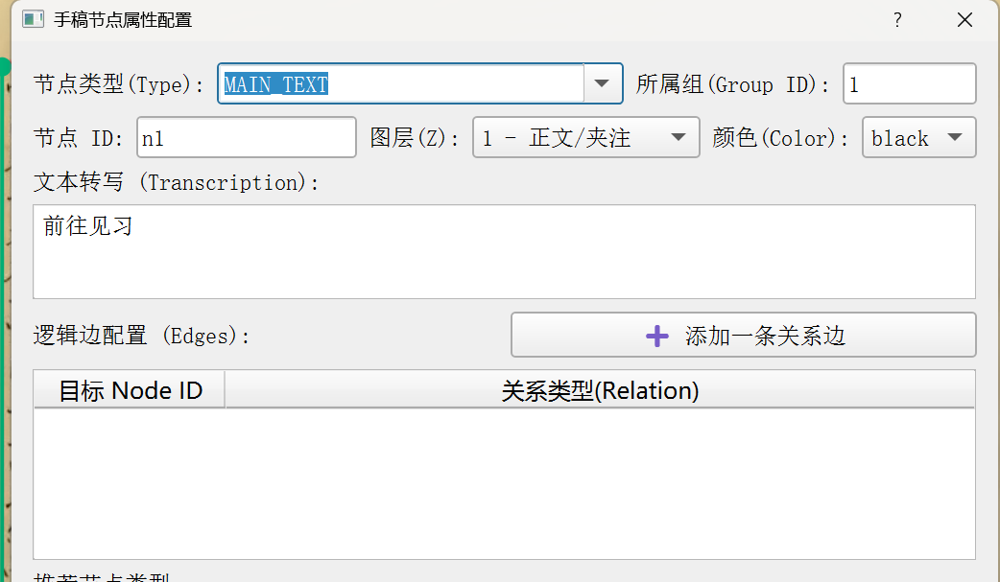
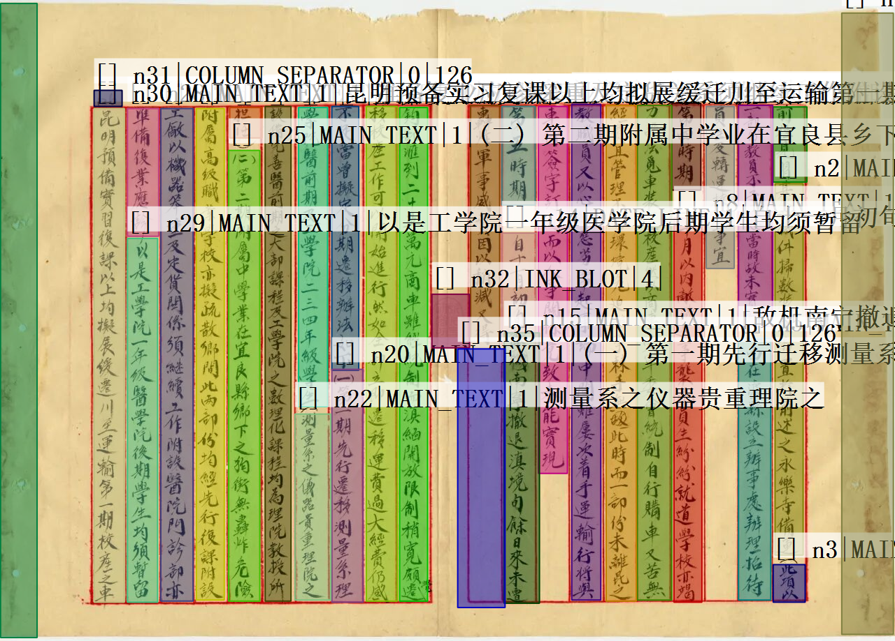

# MyLabelme: 面向项目的定制化标注工具

这是一个基于官方 [Labelme](https://github.com/wkentaro/labelme) 进行深度二次开发的定制版本，专门为我们的数据标注项目量身打造。

在保留了原版强大的多边形、矩形等基础标注能力的同时，我们针对项目需求扩展了**节点级属性**、**逻辑连线**以及**一键可视化**等核心功能。

---

## 🚀 快速安装

本项目采用 Git 源码托管，无需繁琐的打包或下载压缩包，只需一条命令即可完成安装和后续更新。

**环境要求：**

- 建议在 Anaconda 虚拟环境中运行（Python 3.8+）
- 电脑需安装好 Git 工具

**安装命令：**
打开终端（或 Anaconda Prompt），激活你的虚拟环境，然后执行：

```bash
pip install git+[https://github.com/shemufan/Mylabelme_-labelme-.git](https://github.com/shemufan/Mylabelme_-labelme-.git)
```

**更新指南：** 如果收到工具更新的通知，只需在终端执行以下命令即可覆盖升级： `pip install --upgrade git+https://github.com/shemufan/Mylabelme_-labelme-.git`

---

## 🛠️ 新增核心功能指南

### 1. 扩展的属性配置面板

当你完成一个图形（如多边形、矩形）的绘制后，弹出的不再是简单的类别输入框，而是我们**专属定制的属性配置面板**。

在这里，你可以详细填写：

- **节点 ID (Node ID):** 为当前标注对象分配唯一标识（如 `n_main_1`）。

- **节点类型Type(Type):** 选定当前文本的类型。

- **文本转写 (Transcription):** 记录该区域内的文字内容。

- **图层 (Z-Index) & 颜色 (Color):** 快速配置视觉层级和显示颜色。

- **逻辑边配置 (Edges):** 点击 ➕ 按钮，即可快速建立当前节点与目标节点的关联关系（如 `ANNOTATES`, `REPLACES` 等）。



_注意：所有这些扩展字段都将无损保存到最终生成的 JSON 文件中，完美契合我们的算法训练数据格式要求。_

### 2. 一键导出可视化图片

为了方便项目审核、论文配图或直观检查标注质量，我们集成了**一键渲染**功能。

**操作步骤：**

1. 在软件中打开图片并完成标注（确保填写了 Node ID 和逻辑连线）。

2. 点击顶部菜单栏的 **File (文件) -> 导出可视化图片(&E)**，或直接使用快捷键 `Ctrl+E`。

3. 选择保存路径，软件将自动把多边形框、截断版转写文本、以及节点间的**虚线逻辑连线**绘制在原图上，并导出一张高清晰度的成品图片。



---

## 💻 启动软件

安装完成后，在终端中直接输入以下命令即可启动：

Bash

```
labelme
```

_(附：支持原版 Labelme 的所有启动参数，如 `labelme [图片路径]` 直接打开某张图片。)_

---

**Maintainer:** shemufan **Powered by PyQt5 & Pillow**